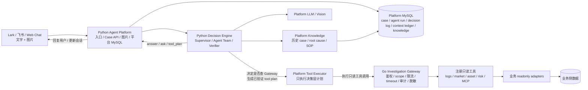

# ai-troubleshooter

业务问题排查 Agent 平台。一期目标是把 Lark/飞书、Web Chat、截图和简短用户反馈统一转成可审计的排障 case，让 Agent 先复用平台经验，再按预算调用受控只读工具，快速定位生产问题。

当前仓库采用 monorepo：

- Python 3.13：`apps/agent-platform` 是平台入口，承接 Web Chat、Lark/飞书、图片、Case API、平台 MySQL、LLM/Vision 配置、Agent Run 观测和经验沉淀。
- Python 3.13：`apps/decision-engine` 是决策层，承接 Supervisor、多 specialist agent、工具计划、Verifier、后续 RAG 和本地代码辅助排查。
- Go 1.24+：只保留 `cmd/investigation-gateway`，负责业务 readonly tools、安全鉴权、scope、限流、timeout、审计和脱敏。
- MySQL：平台 case、消息、AI 决策日志、Agent Run、runtime 心跳、context ledger、tool audit、root cause、knowledge item 和自进化记录。

## 核心边界

- Agent 不可信，Gateway 可信：Agent 只做理解、规划和总结；生产证据查询必须走 Investigation Gateway。
- 平台数据归平台：case、消息、经验、审计、AI 决策日志属于 Agent 平台，不需要业务方提供 query gateway。
- 业务方只提供只读证据：日志、行情、资产、风控、缓存、发布记录等都通过 readonly adapter 或 MCP readonly adapter 注册到 Gateway。
- 信息不足先追问：用户最多只需要提供自然语言、截图、uid、订单号、时间范围等线索，不要求懂内部字段名。
- 每次排查都可复盘：工具调用、AI 为什么这样判断、为什么停止、人工根因和知识沉淀都会落库。
- 生产安全 fail-closed：Gateway 鉴权、scope、限流、timeout、脱敏、审计、控制面鉴权和 Lark allowlist 都支持配置化。

## 一期架构

完整部署图和流程图见 [docs/architecture-decisions.md](docs/architecture-decisions.md)。README 只保留入口视图：



## 当前状态

| 模块 | 状态 |
| --- | --- |
| Agent Platform | Python FastAPI 主服务，提供 Web Chat、Case API、平台 MySQL、图片入口、Qwen/GPT LLM + Vision 配置、异步排查、进度 API、Agent Run API、runtime 注册心跳、知识和能力管理。 |
| Web Chat 工作台 | 由 Python Agent Platform 服务，支持文字、图片粘贴上传、图片预览、case 列表重命名/删除、草稿本地保存、进度面板、Agent Run 轨迹、工具分组、知识预览/编辑。 |
| Lark / 飞书入口 | 归属 Python Agent Platform；已支持 challenge、encrypted callback 解包、verification token、群 allowlist、消息幂等和图片下载入口。真实 bot 仍需要公司凭据和公网/内网回调地址联调验收。 |
| Case / Knowledge / Audit | Python Agent Platform 写平台 MySQL；Go Gateway 只写工具审计。Agent Run 和 Context Ledger 记录排查轨迹、压缩上下文和证据引用，不把原始工具数据塞进 LLM。`DB_DRIVER=mysql` 时没有 DB 配置会失败。 |
| Decision Engine | Python 已提供 Supervisor、Kline、Asset、HealthFood、Knowledge、Local Code、Verifier；Web Chat/Lark/飞书主路径都会在 Agent Platform 进程内调用 `DecisionEngine.plan()`，是否复用经验、是否查询 Gateway、查询哪些工具都由决策层决定。 |
| Local Agent Runtime | 参考 Multica 的 runtime/provider 思路，Python Agent Platform 可发现本机 Claude Code、Codex、Cursor/Cursor Agent，显式启用后可把支持非交互 JSON 的本地 agent 作为 `llm_decision_agent` advisor；Verifier 仍执行工具预算和 Gateway-only 校验。 |
| Investigation Gateway | 已实现 Bearer、agent/scope/tool/chat allowlist、限流、timeout、审计、脱敏、动态只读工具发布和配置化 agent。 |
| 业务接入 | 支持 mock、标准 HTTP readonly adapter、MCP readonly adapter、Web 录入能力、health-food 本地真实 adapter 和生产日志桥接方案。 |
| 本地代码辅助 | debug-only，按服务名和仓库 allowlist 检索符号、调用边、receiver type、接口实现关系，并返回有界脱敏代码摘录、具体方法、行范围、疑点和下一步核对建议。 |

详细能力清单和历史验收记录请看 [programs/README.md](programs/README.md) 以及各 `programs/P-*` 的 `RESULT.md` / `EVIDENCE.md`。

## 快速启动

需要 Go 1.24+、Python 3.13 和 MySQL。敏感信息只允许通过环境变量传入。

```bash
python3.13 --version
go version
python3.13 -m venv .venv
.venv/bin/python -m pip install -e apps/agent-platform

MYSQL_HOST=127.0.0.1 \
MYSQL_PORT=3306 \
MYSQL_USER=root \
MYSQL_PASSWORD="$LOCAL_MYSQL_PASSWORD" \
MYSQL_DATABASE=ai_troubleshooter \
make migrate-mysql

export DB_DRIVER=mysql
export DB_DSN="$LOCAL_DB_DSN"
export CONNECTOR_MODE=mock
export AI_MODEL_PROFILE=qwen
export AI_MODEL_CONFIG_FILE="$HEALTH_FOOD_LOCAL_CONFIG" # 可选：读取本机已有模型配置
export DASHSCOPE_API_KEY="$LOCAL_DASHSCOPE_API_KEY"    # 或直接通过环境变量给 key
export QWEN_VISION_MODEL=qwen-vl-plus
export AGENT_PLATFORM_PORT=19091
export HTTP_PORT=18080

# 终端 1：业务只读 Gateway
make gateway

# 终端 2：Python Agent Platform
make dev
```

本地平台库固定为 `ai_troubleshooter`，不要为每个验证新建 `ai_troubleshooter_*`。重复 schema 盘点和显式清理见 [docs/local-runbook.md](docs/local-runbook.md)。

打开 `http://localhost:19091/web`。本地开发如果端口冲突，可以改 `AGENT_PLATFORM_PORT`。

平台 API 同时提供 `/web/api/*` 给工作台使用，以及 `/api/v1/*` 给自动化或业务接入测试使用，例如：

```bash
curl -s -X POST http://localhost:19091/api/v1/chat \
  -F 'message=health-food uid hf-user-001 today token quota wrong' \
  -F 'async=0'
```

没有模型 key 时可以临时用 `LLM_PROVIDER=local_rules` 做页面 smoke，但这不是大模型验收，不能把结果当成真实排障结论。

本地已经安装 Claude Code 或 Codex 时，也可以让 Python 决策层通过本地 agent CLI 做 advisor：

```bash
export AI_MODEL_PROFILE=local_agent
export LOCAL_AGENT_PROVIDER=codex        # auto / codex / claude_code
export LOCAL_AGENT_WORKSPACE_ROOT="$PWD"
export DECISION_LLM_ENABLED=true
```

Web 右侧“本地 Agent”会发现并注册本机 runtime；启用只代表平台允许它作为候选，生产证据查询仍只能走 Gateway。

更完整的本地运行、Web Chat、模型、health-food、MCP、DMS 和容器命令已经移到 [docs/local-runbook.md](docs/local-runbook.md)。

提交前建议安装 hook 并扫描敏感信息：

```bash
make install-hooks
make secret-scan
```

## 目录速览

```text
api/openapi/               Case、Decision Engine、Gateway OpenAPI 草案
apps/agent-platform/       Python FastAPI Agent 平台入口
apps/decision-engine/      Python 3.13 决策层
cmd/                       investigation-gateway
configs/                   配置样例、Gateway agent、业务能力和 MCP route 示例
deploy/                    Docker Compose 示例
docs/                      架构、安全、接入、运行、验证和经验沉淀文档
internal/                  Go Gateway、connector、policy、storage
migrations/                MySQL 表结构
programs/                  Program 记录、验收证据、复盘和交付结果
scripts/                   migration、secret scan、adapter、MCP、hook 脚本
web/                       内置 Web Chat 静态页面
```

## 文档地图

| 主题 | 文档 |
| --- | --- |
| 开发规则 | [AGENTS.md](AGENTS.md), [docs/ai-workflow.md](docs/ai-workflow.md), [docs/VERIFICATION.md](docs/VERIFICATION.md), [docs/LESSONS.md](docs/LESSONS.md) |
| 架构与边界 | [docs/architecture-decisions.md](docs/architecture-decisions.md), [docs/phase1.md](docs/phase1.md) |
| 本地运行 | [docs/local-runbook.md](docs/local-runbook.md), [docs/web-workbench.md](docs/web-workbench.md), [apps/decision-engine/README.md](apps/decision-engine/README.md) |
| 业务方从零接入 | [docs/business-onboarding-quickstart.md](docs/business-onboarding-quickstart.md) |
| 业务接入 | [docs/ai-connector-integration.md](docs/ai-connector-integration.md), [docs/business-service-registration.md](docs/business-service-registration.md), [configs/business-capabilities.health-food.example.yaml](configs/business-capabilities.health-food.example.yaml) |
| 安全与控制 | [docs/gateway-security.md](docs/gateway-security.md), [docs/decision-logging-and-limits.md](docs/decision-logging-and-limits.md), [docs/deployment-checklist.md](docs/deployment-checklist.md) |
| MCP / DMS | [docs/mcp-gateway-adapter.md](docs/mcp-gateway-adapter.md), [docs/dms-mcp-integration.md](docs/dms-mcp-integration.md) |
| health-food | [docs/health-food-production-integration.md](docs/health-food-production-integration.md) |
| 经验沉淀 | [docs/knowledge-evolution.md](docs/knowledge-evolution.md), [api/openapi/case-knowledge-api.yaml](api/openapi/case-knowledge-api.yaml) |
| API | [api/openapi/decision-engine.yaml](api/openapi/decision-engine.yaml), [api/openapi/investigation-gateway.yaml](api/openapi/investigation-gateway.yaml), [api/openapi/case-knowledge-api.yaml](api/openapi/case-knowledge-api.yaml) |

## 验证

```bash
make test
make secret-scan
git diff --check
```

涉及前端、Gateway、MySQL、真实 adapter 或生产只读接口的改动，不能只算 mock 通过。验收必须实际启动服务、从入口调用成功，并在对应 Program 或文档里记录命令、结果和证据等级。

## 当前边界

- Redis Stream 仍未替换内存队列，接口已预留。
- 真实业务接入需要业务方提供 readonly adapter 或 MCP server，并在 Web 工作台或 Gateway manifest 注册。
- 生产问题排查不允许 Agent 直连生产 DB；确需 DB 证据时优先用 DMS MCP 元数据或 named readonly query adapter。
- Lark/飞书真实端到端需要公司 bot 凭据、回调地址和 allowlist 配置；encrypted callback 的本地解包链路已实现，外部平台验签/送达仍需联调。
- 图片默认只做短暂下载并传给视觉模型，原图不持久化；如需留存，应接公司对象存储和数据分级策略。

## 开源许可与贡献

本项目使用 Apache License 2.0，适合企业内部二次开发、私有化部署和按需封装业务 adapter。贡献前请阅读 [CONTRIBUTING.md](CONTRIBUTING.md)，安全问题按 [SECURITY.md](SECURITY.md) 私下披露。
