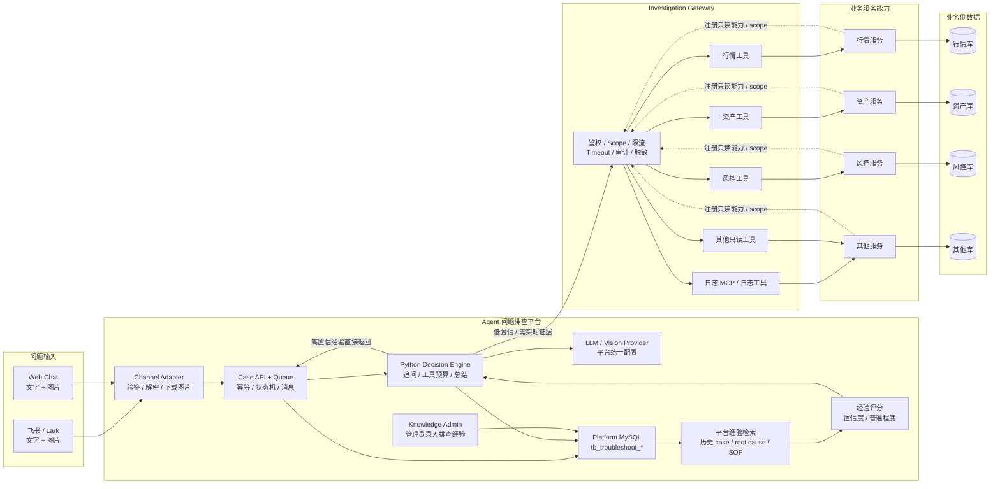
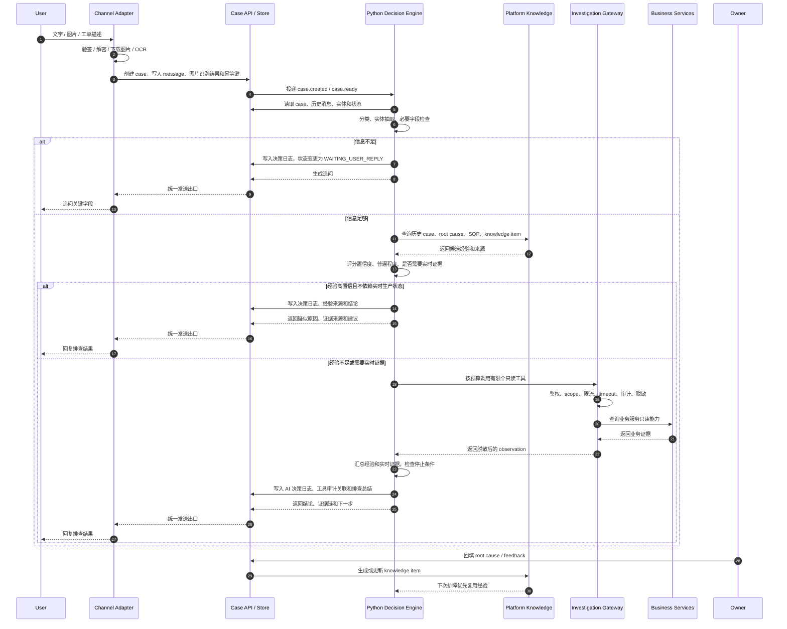

# ai-troubleshooter

一期业务工单排障 Agent 平台。当前仓库采用 monorepo：Go 1.24+ 负责 Lark/飞书入口、Gateway、worker、Case API 和平台数据落库；Python 3.13 决策层放在 `apps/decision-engine`，当前提供有限工具计划 API，后续承接 Agent 编排、多模型、RAG 和本地代码辅助排查生态。Go 里只保留 `decisionbaseline` 作为 phase-0 本地 fallback，不作为目标决策层。

## 为什么做这个

线上业务问题经常从客服工单、Lark 群、截图和简短描述进入研发排查流程。典型输入并不完整，比如“余额变少了”“K线不对”“数据不对”，人工排查需要反复追问、查日志、查缓存、核对业务数据和外部交易所。这个项目的目标不是替代 SRE 平台，也不是让 Agent 自动修复生产，而是先把“用户反馈类业务故障”的排查过程 case 化、工具化、审计化，并逐步沉淀成可复用经验库。

一期先把生产可控性放在第一位：Agent 可以推理和编排，但不能直接拥有生产权限；所有业务生产证据查询必须走受控网关；所有工具只读；所有调用留审计；信息不足时先问人。

## 一期范围

- Lark 群消息创建排障 case，默认优先支持 Lark 国际版，同时兼容飞书中国站。
- Agent 先做分类、实体抽取和必要字段检查，信息不足时追问。
- 信息足够后由 Decision Engine 规划有限工具，通过 Investigation Gateway 调用业务只读证据接口。
- 工具调用默认 deny，只有注册 agent、授权 scope、启用工具才可执行。
- 每次工具调用写 audit，返回前统一脱敏。
- K线/行情异常和资产/余额异常先接 mock connector，后续替换真实只读 API。

## 设计思路

### 1. Agent 不可信，Gateway 可信

Agent 负责理解问题、抽取字段、判断是否需要追问、决定调用哪些工具和总结证据。但 Agent 不直接连接生产 DB、Redis、日志系统或业务服务。所有业务生产查询都必须经过 Investigation Gateway。

平台自己的 case、消息、AI 决策日志、工具审计和知识沉淀属于 Agent 平台数据，不属于业务方提供的查询源，也不需要通过 Gateway 当成下游接口访问。

Gateway 是业务生产只读查询门禁，负责：

- 校验 agent 身份和授权 scope。
- 校验 Lark 用户、群和工具权限。
- 限制时间范围、limit、工具调用超时。
- 统一脱敏。
- 统一审计。
- 只允许调用注册过的只读工具。

这样即使 LLM 输出不稳定，也不会把权限判断交给模型。

### 2. 信息不足先问人

排障的第一步不是查生产，而是判断最小必要字段是否齐全。比如 K线问题至少需要 `symbol`、`interval`、`abnormal_time`、`issue_type`；资产问题至少需要 `user_id` 或 `account_id`、`asset_symbol`、`abnormal_time`、`issue_type`。

字段不足时，Agent 最多追问 3 个关键问题，并把 case 状态推进到 `WAITING_USER_REPLY`。字段足够后才进入工具查询阶段。

### 3. Case 状态机管理生命周期

每个用户反馈都会被创建成独立 case，并通过状态机推进：

```text
NEW
  -> NEED_MORE_INFO
  -> WAITING_USER_REPLY
  -> READY_TO_INVESTIGATE
  -> INVESTIGATING
  -> WAITING_TOOL_RESULT
  -> NEED_HUMAN_CONFIRMATION
  -> DONE / FAILED / CANCELLED
```

状态更新带版本号，后续接 MySQL 时用乐观锁避免多个 worker 同时处理同一个 case。

### 4. 事件驱动并发

Lark Bot 只负责接收事件、创建 case、发送即时回复和投递队列，不做复杂推理，也不查生产。Agent Worker 从队列消费 case event，用 worker pool 并发处理多个客服问题。队列目前是内存实现，接口已经抽象，后续替换为 Redis Stream。

### 5. Investigation Gateway 只做业务只读工具门禁

TRD 里 Tool Server 和 Query Gateway 是两个逻辑层；这里的 Query Gateway 只指“业务生产证据查询门禁”，不是平台数据访问入口。一期为了更快跑通，在 `investigation-gateway` 进程内同时实现业务只读工具门禁：

- Tool Registry：注册工具描述、入参 schema、scope、handler。
- Tool Invoke API：`GET /tools` 和 `POST /tools/{tool_name}/invoke`。
- Policy Engine：默认拒绝，只允许注册 agent 和授权 scope。
- Audit：记录每次业务只读工具调用。
- Masking：返回前脱敏。
- Connectors：对接业务只读 API、日志、缓存、外部交易所。

Gateway 不负责查询平台数据。平台 MySQL 由 Case Layer、Decision Engine 和审计 sink 按平台内部权限访问；Gateway 只保护“查业务生产证据”这条边界。代码层面仍然保持包边界，后续可以把 Tool Server 和 Gateway 拆成两个服务，或者补 MCP adapter。

业务服务能力通过 Gateway 注册和授权后才能被 Agent 使用。Gateway 校验 `agent / scope / case / user / tool / limit / timeout`，业务服务也应校验来自 Gateway 的内部身份，形成双层鉴权。日志 MCP、行情、资产、风控等能力都只作为 Gateway 后面的受控工具暴露，决策层不直接连接 MCP 或业务服务。

### 6. 业务接入优先只读 API

Gateway 底层优先接业务服务提供的只读 API，而不是让 Agent 或 Gateway 自由 SQL。确实需要直查 DB 时，只允许走预注册 SQL 模板、read replica、参数化查询、强制 limit 和 timeout。

当前实现先用 mock connector：

- K线：内部 K线、外部交易所对比、缓存状态、行情源状态。
- 资产：资产快照、资产事件流、用户近期错误。
- 通用：日志摘要、发布记录、历史相似 case。

### 7. 平台经验优先复用

决策层不应该每次都先查下游。字段足够后先查 Agent 平台自己的历史 case、root cause、SOP 和 knowledge item，再由决策层判断经验匹配分、问题普遍程度和置信度：

- 经验命中且置信度高，且问题不依赖强实时生产状态：可以直接返回疑似原因、处理建议和经验来源。
- 经验命中但置信度一般，或需要确认当前生产状态：返回经验提示，同时做一轮有限业务证据查询。
- 经验未命中或证据不足：通过 Investigation Gateway 查询业务只读证据。

经验命中不能盲信。所有直接返回都要写 AI 决策日志，记录为什么认为经验可用、置信度是多少、为什么没有继续查下游。

### 8. 每次排查都沉淀

一期数据表围绕 case、实体、消息、investigation、tool audit、root cause、knowledge item 设计。这些表是 Agent 平台自己的沉淀，不要求业务方提供。即使 AI 没查准，也要保留原始问题、抽取字段、调用过程、AI 判断和人工最终根因。失败样本同样是后续优化 prompt、工具和知识库的材料。

## 一期部署架构



业务方开箱接入时只需要补两类东西：

- 输入入口配置：Lark/飞书机器人，或启用 Web Chat。
- 业务只读证据接口：按 [AI 接入规范：业务只读接口封装](docs/ai-connector-integration.md) 封装 readonly adapter。

平台方负责统一提供 MySQL、LLM/Vision、Gateway token、控制面 token、审计和知识沉淀配置。如果业务方选择私有化部署整套平台，这些配置由部署方填写，但它们仍属于 Agent 平台配置，不属于业务 adapter 接口。

向量库、发布记录、本地代码查看、多 Agent workflow 都不是一期部署前置条件；这些演进能力记录在 [架构决策记录](docs/architecture-decisions.md)。

### 单 case 排障流程



### 组件职责

| 组件 | 当前状态 | 职责 |
| --- | --- | --- |
| Lark / 飞书入口 | 代码实现 + 本地 payload/unit 验证 | 接收消息、验 token、解密 callback、下载图片、创建 case；真实 bot 端到端仍需公司凭据验收。 |
| Web Chat 入口 | 已实现 + MySQL 本地验收 | 给不用 Lark/飞书的团队提供网页文字输入和图片上传入口，支持本地 mock Gateway 排障验证。 |
| Case Layer | 已实现 | 管理 case 状态机、消息、幂等、AI 决策日志和知识沉淀。 |
| Decision Layer | Python 3.13 target + Go fallback | Python 已有 Supervisor/Specialist 规则基线和 plan API；当前 Go worker 尚未切到 Python，Go baseline 只用于本地闭环/fallback；只能通过 Gateway 查询业务生产证据。 |
| Platform Knowledge | SQL/tag/keyword first | 平台侧历史 case、root cause、SOP 和 knowledge item；首发不强依赖向量库。 |
| Investigation Gateway | 已实现 | 业务生产只读查询安全边界：鉴权、scope、限流、timeout、审计、脱敏、工具注册；不是平台数据访问入口。 |
| Business Services / Adapters | mock + HTTP/MCP 规范 + health-food 本地真实 adapter | 注册并提供业务只读能力，服务自身访问自己的 DB，Agent 不直接对 DB；生产真实接口需按业务方只读 adapter 验收。 |

本地 MVP 用 `cmd/dev-server` 把这些模块合并在一个进程里，方便先验证闭环。部署时建议拆成 `lark-bot`、`case-api/worker`、`decision-engine`、`investigation-gateway` 四类服务。`cmd/baseline-orchestrator` 只保留给本地 smoke 或兼容 fallback，不作为目标生产编排服务。

## 目录

```text
.github/
  workflows/                CI：Go / Python / secret scan
api/
  openapi/                  Case、Decision Engine、Investigation Gateway OpenAPI 草案
apps/
  decision-engine/         Python 3.13 决策层服务，后续承接多模型/RAG/workflow
cmd/
  baseline-orchestrator/   Go phase-0 决策 fallback，不是目标决策层
  dev-server/              本地一体化调试入口
  lark-bot/                Lark 事件入口
  worker/                  case event worker，后续可调用 Python decision-engine
  investigation-gateway/   业务只读工具门禁
internal/
  audit/                   工具调用审计 sink
  caseflow/                case 模型、状态机、内存 store
  chatplatform/            Lark / 飞书平台差异封装
  config/                  环境变量配置和生产 fail-closed 校验
  connectors/              K线、资产、日志 mock / HTTP readonly connector
  decisionbaseline/         Go phase-0 有限工具计划 fallback
  evolution/               root cause 回填后的经验自进化逻辑
  gateway/                 Tool API、policy、audit、masking、connector 编排
  httpauth/                控制面 Bearer 鉴权
  lark/                    Lark 事件 handler 和消息发送抽象
  llm/                     LLM 抽象、规则 fallback、OpenAI-compatible client
  masking/                 脱敏
  policy/                  默认拒绝策略
  queue/                   可替换队列接口和内存实现
  ratelimit/               固定窗口限流
  storage/mysql/           MySQL store 和 tool audit 持久化
  tool/                    Tool Spec、Registry、Invocation 模型
  vision/                  图片 OCR / 视觉识别抽象和 OpenAI-compatible client
  webchat/                 内置 Web Chat API handler
  worker/                  case event worker pool
configs/                   配置样例
deploy/                    Docker Compose 示例
docs/                      架构、安全、接入、验证和经验沉淀文档
githooks/                  pre-commit / pre-push secret scan hook 模板
migrations/                MySQL 初始化表
programs/                  可恢复任务记录、证据、复盘和交付结果
scripts/                   MySQL migration、secret scan、hook 安装脚本
web/                       内置 Web Chat 静态页面和 Go embed
```

## 文档地图

| 文档 | 用途 |
| --- | --- |
| [AGENTS.md](AGENTS.md) | AI Agent 进入仓库后的工作规则、Program 规则、验证和提交约束。 |
| [docs/architecture-decisions.md](docs/architecture-decisions.md) | 架构边界、部署图、流程图、平台数据和业务 Gateway 分界。 |
| [docs/ai-connector-integration.md](docs/ai-connector-integration.md) | 业务方只读接口接入规范，定义接口命名、参数、返回、错误和 adapter 规则。 |
| [docs/business-service-registration.md](docs/business-service-registration.md) | 业务服务注册到 Gateway 的 manifest 数据结构、capability 字段和 health-food 示例。 |
| [docs/health-food-production-integration.md](docs/health-food-production-integration.md) | health-food 生产只读日志接入方式、本地启动命令、安全限制和验收标准。 |
| [docs/web-workbench.md](docs/web-workbench.md) | Codex 风格 Web 排障工作台、进度轮询、工具/知识展示和手动知识录入接口。 |
| [docs/gateway-security.md](docs/gateway-security.md) | Gateway 鉴权、agent 绑定、scope、限流、timeout、脱敏和审计边界。 |
| [docs/mcp-gateway-adapter.md](docs/mcp-gateway-adapter.md) | MCP server 通过 readonly adapter 接入 Gateway 的方式和验收标准。 |
| [docs/dms-mcp-integration.md](docs/dms-mcp-integration.md) | 阿里云 DMS MCP / CLI 调研结论、安全接入方案和 DB 元数据接入路线。 |
| [docs/decision-logging-and-limits.md](docs/decision-logging-and-limits.md) | AI 决策日志、工具预算、失败上限、case timeout 和停止条件。 |
| [docs/knowledge-evolution.md](docs/knowledge-evolution.md) | root cause 回填、经验沉淀、knowledge item 和自进化逻辑。 |
| [docs/agent-framework-selection.md](docs/agent-framework-selection.md) | Python 决策层框架选择，记录 LangGraph / LangChain 等后续迁移触发条件。 |
| [docs/deployment-checklist.md](docs/deployment-checklist.md) | 公司级部署检查清单，覆盖配置、安全、数据库、观测和回滚。 |
| [docs/ai-workflow.md](docs/ai-workflow.md) | 本项目接入 ai-workflow / Program 机制的编码规范。 |
| [docs/VERIFICATION.md](docs/VERIFICATION.md) | 验证结果记录规范，要求 Evidence 索引、命令验证和覆盖映射。 |
| [docs/LESSONS.md](docs/LESSONS.md) | 开发复盘和防复发规则。 |
| [docs/phase1.md](docs/phase1.md) | 一期实现说明和历史上下文。 |
| [apps/decision-engine/README.md](apps/decision-engine/README.md) | Python Decision Engine 本地启动和 plan API smoke。 |
| [api/openapi/decision-engine.yaml](api/openapi/decision-engine.yaml) | Python 决策层 HTTP API 草案。 |
| [api/openapi/investigation-gateway.yaml](api/openapi/investigation-gateway.yaml) | Gateway 工具调用 API 草案。 |
| [api/openapi/case-knowledge-api.yaml](api/openapi/case-knowledge-api.yaml) | Case、root cause、feedback、knowledge 控制面 API 草案。 |
| [programs/README.md](programs/README.md) | Program 工作流、证据、复盘和长任务恢复规则。 |

最新完成的 Program：

- [P-2026-008 Web Chat Local Agent MVP](programs/P-2026-008-web-chat-local-agent-mvp/RESULT.md)：内置 Web Chat、MySQL 本地落库、Qwen/Qwen-VL smoke、secret hook。
- [P-2026-009 Web Chat Verification Hardening](programs/P-2026-009-web-chat-verification-hardening/RESULT.md)：补充 Web 多场景验证、Gateway 输出脱敏和超时 504 单测。
- [P-2026-013 Local Code Intelligence](programs/P-2026-013-local-code-intelligence/RESULT.md)：debug-only 本地代码辅助排查，支持关键词、符号和调用边。
- [P-2026-014 Semantic Code Index](programs/P-2026-014-semantic-code-index/RESULT.md)：跨模块调用边解析、receiver type、接口实现关系和 tree-sitter/LSP/LSIF backend 配置预留。
- [P-2026-015 MCP Gateway Adapter](programs/P-2026-015-mcp-gateway-adapter/RESULT.md)：MCP server 通过 allowlist readonly adapter 接入 Gateway，并用 health-food 实际链路验证。
- [P-2026-016 Config Driven Gateway Auth](programs/P-2026-016-config-driven-gateway-auth/RESULT.md)：Gateway agent/scope/tool/chat 权限配置化，runner agent id 可配置。
- [P-2026-018 Web Workbench Progress UI](programs/P-2026-018-web-workbench-progress-ui/RESULT.md)：Codex 风格三栏 Web 工作台，支持异步排查进度、工具/知识查看、手动知识录入和删除。
- [P-2026-019 DMS MCP Investigation](programs/P-2026-019-dms-mcp-investigation/RESULT.md)：阿里云 DMS MCP / CLI 调研、DMS 元数据 route 样例和 MCP 参数映射增强。

## 已实现能力

- Go + Python monorepo 和一期目录结构。
- 本地一体化 `dev-server`。
- 内置 Web 排障工作台：`GET /` 或 `/web` 打开 Codex 风格三栏页面，`POST /web/api/chat` 支持文字和图片上传，`async=1` 时会立即创建/继续 case 并通过 `/web/api/cases/{case_no}` 轮询展示决策进度。
- Lark / 飞书事件入口：`POST /lark/events` 和 `POST /feishu/events`，支持本地模拟 payload 和 Lark/Feishu v2 消息 payload。
- Lark verification token 和 allowed chat 基础门禁。
- Lark encrypted callback：配置 `LARK_ENCRYPT_KEY` 后只接受密文回调，先解密 `encrypt` 回调体，再验 token 和处理 challenge / message。
- Lark/Feishu `source + message_id` 幂等去重，平台重复投递不会重复创建 case 或重复入队。
- 配置 `LARK_APP_ID` / `LARK_APP_SECRET` 后，Bot 会通过对应开放平台发送文本回复；未配置时本地只写日志。
- `LARK_PLATFORM` 默认 `lark`，自动使用 `https://open.larksuite.com`；设为 `feishu` 时自动使用 `https://open.feishu.cn`；`LARK_API_BASE_URL` 可显式覆盖，适合公司代理网关。
- Lark/Feishu 图片消息下载：从消息 `content` 中提取 `image_key`，通过消息资源接口下载图片，调用视觉模型识别后写入 `case.ocr_text`；原图不落库。
- 多模型链路：默认复用主 LLM 的图片能力；只有显式配置 `VISION_*` 时才启用独立视觉模型，适合用 Qwen-VL 先识别截图。
- Python Decision Engine：`apps/decision-engine` 已提供 Supervisor + Kline Agent + Asset Agent + Knowledge Agent + Local Code Agent + Verifier 的有限工具计划 API、Gateway client、OpenAPI 草案和单元测试。
- Local Code Agent：debug-only、allowlist、无源码片段，支持关键词、语言结构符号、调用边、跨模块 resolved symbols、Java receiver type 和接口实现关系；tree-sitter/LSP/LSIF 作为后续 backend 插槽预留。
- Case 创建、状态流转、消息和实体记录。
- Worker pool 消费 case event。
- LLMClient 抽象和规则型本地实现。
- AI 决策日志：分类、实体抽取、字段检查、工具计划、工具调用、总结、失败原因、重复处理跳过原因、陈旧处理中状态收敛原因均可审计，快照写入前会统一脱敏。
- Web 工作台进度：右侧按 AI 决策日志展示 `classify_issue`、`extract_entities`、`required_fields_check`、`knowledge_retrieval`、`decide_next_action`、`tool_invocation`、`summarize_findings`。
- Case 级排查超时、工具调用总数上限和工具失败上限，避免查不到问题时持续打下游。
- Decision runner 处理前先认领 case；重复 worker、重复事件或终态 case 会安全跳过，不再查询下游；陈旧处理中状态会恢复或失败收敛。
- Tool Registry 和内部 Tool Invoke API。
- Investigation Gateway 默认拒绝策略、scope 校验、参数边界控制。
- Gateway HTTP Bearer 鉴权、认证 agent 与请求 `agent_id` 绑定、agent/user/tool 固定窗口限流。
- Gateway agent 权限配置化：可通过 `GATEWAY_AGENT_CONFIG_FILE` / `GATEWAY_AGENT_CONFIG_JSON` 配置 agent、scope、tool、chat allowlist 和 `bearer_token_env`，新增业务 agent 不需要改代码。
- 控制面 API Bearer 鉴权，生产环境缺少关键安全配置时 fail-closed。
- Audit sink、MySQL tool audit 持久化和脱敏。
- 14 个一期只读工具。
- K线、资产、日志、health-food mock connector。
- health-food 故障域、本地 readonly adapter、AI 配额 / 餐食 / 每日推荐只读工具和服务注册 manifest 示例。
- health-food 真实本地联调 adapter：`scripts/real-health-food-readonly-adapter.py` 可连接本地测试 DB 和本地 health-food 服务，验证注册用户、餐食、AI 配额、每日推荐状态和 adapter 鉴权，不用 mock 故障数据冒充验收。
- 标准 HTTP 只读 connector，可按文档对接公司接口。
- MCP readonly adapter：外部 MCP server 可通过 allowlist route 映射成标准 readonly adapter，再由 Gateway 调用；决策层不直连 MCP。
- 人工 root cause 回填、case feedback、knowledge item 自进化和 evolution run 记录。
- Web 工作台支持查看平台经验沉淀，并可手动录入或软删除指定知识条目。
- MySQL store：默认 `DB_DRIVER=mysql` 时必须配置 `DB_DSN`，case、消息、根因、反馈、知识库和自进化运行记录都会持久化；只有显式设置 `DB_DRIVER=memory` 才允许使用内存 store 做一次性 smoke。
- MySQL 初始化 migration。
- 知识沉淀增强 migration。
- AI 决策日志 migration。
- 事件幂等索引 migration。
- OpenAPI 草案。
- 单元测试覆盖状态机、policy、masking、tool registry、HTTP connector envelope、Lark payload、知识自进化。

## 本地 Web Chat 启动

1. 准备本地 MySQL，并通过环境变量传入连接信息，不要写入仓库文件。
2. 执行迁移：

```bash
MYSQL_HOST=127.0.0.1 MYSQL_PORT=3306 MYSQL_USER=root MYSQL_PASSWORD="$LOCAL_MYSQL_PASSWORD" MYSQL_DATABASE=ai_troubleshooter make migrate-mysql
```

3. 启动服务：

```bash
export DB_DSN="$LOCAL_DB_DSN"
export DB_DRIVER=mysql
export CONNECTOR_MODE=mock
export LLM_PROVIDER=openai_compatible
export LLM_BASE_URL=https://dashscope.aliyuncs.com/compatible-mode/v1
export LLM_MODEL=qwen-plus
export LLM_API_KEY="$DASHSCOPE_API_KEY"
export VISION_PROVIDER=qwen_openai_compatible
export VISION_BASE_URL=https://dashscope.aliyuncs.com/compatible-mode/v1
export VISION_MODEL=qwen-vl-plus
export VISION_API_KEY="$DASHSCOPE_API_KEY"
make dev
```

4. 浏览器打开 `http://localhost:8080/`，输入问题或上传截图。左侧可查看问题会话、已注册 Gateway tools 和平台经验；右侧可查看当前排查状态和决策层步骤。
5. 如果只是做一次性前端 smoke，可以显式设置 `DB_DRIVER=memory` 且不要配置 `DB_DSN`；任何需要验证平台经验沉淀、case、消息、审计或 AI 决策日志的场景都必须使用 MySQL 并查询表验证。

所有 key、token、MySQL 密码都只允许通过环境变量传入。提交和推送前请安装本地 hook：

```bash
make install-hooks
make secret-scan
```

## 本地启动

需要 Go 1.24 或更高版本，并确保 `go` 与 `gofmt` 在 PATH 中。Python Decision Engine 使用 Python 3.13：

```bash
go version
python3.13 --version
make test
```

启动一体化 dev server：

```bash
go run ./cmd/dev-server
```

启动 Python 决策层：

```bash
cd apps/decision-engine
python3.13 -m decision_engine --host 127.0.0.1 --port 19092
```

模拟 Lark 事件：

```bash
curl -s localhost:8080/lark/events \
  -H 'Content-Type: application/json' \
  -d '{
    "chat_id":"oc_dev",
    "thread_id":"thread_dev",
    "message_id":"msg_1",
    "user_id":"ou_dev",
    "text":"@排障机器人 用户反馈 BTCUSDT 1m K线价格不一致，异常时间 2026-05-21T20:00:00+08:00，对比 Binance"
  }'
```

飞书中国站事件可使用兼容入口：

```bash
curl -s localhost:8080/feishu/events \
  -H 'Content-Type: application/json' \
  -d '{
    "chat_id":"oc_dev",
    "thread_id":"thread_dev",
    "message_id":"msg_feishu_1",
    "user_id":"ou_dev",
    "text":"@排障机器人 用户反馈 BTCUSDT 1m K线价格不一致，异常时间 2026-05-21T20:00:00+08:00"
  }'
```

查看工具：

```bash
curl -s localhost:8080/tools
```

直接调用工具：

```bash
curl -s localhost:8080/tools/get_asset_snapshot/invoke \
  -H 'Content-Type: application/json' \
  -d '{
    "case_id":"case_dev",
    "agent_id":"business-troubleshooter-v1",
    "caller_user_id":"ou_dev",
    "chat_id":"oc_dev",
    "arguments":{"user_id":"user_123","asset_symbol":"USDT","at_time":"2026-05-21T20:00:00+08:00"}
  }'
```

对接公司只读 adapter：

```bash
CONNECTOR_MODE=http
CONNECTOR_API_KEY=replace-with-internal-token
MARKET_READONLY_BASE_URL=https://market-readonly.example.internal
ASSET_READONLY_BASE_URL=https://asset-readonly.example.internal
OPS_READONLY_BASE_URL=https://ops-readonly.example.internal
HEALTH_FOOD_READONLY_BASE_URL=https://health-food-readonly.example.internal
```

adapter 需要实现的接口见 [docs/ai-connector-integration.md](docs/ai-connector-integration.md)。业务服务注册到 Gateway 的 manifest 结构见 [docs/business-service-registration.md](docs/business-service-registration.md)，health-food 示例见 [configs/business-capabilities.health-food.example.yaml](configs/business-capabilities.health-food.example.yaml)。

对接 MCP server：

```bash
MCP_ADAPTER_API_KEY="$LOCAL_CONNECTOR_API_KEY" \
MCP_READONLY_ADAPTER_PORT=19085 \
python3.13 scripts/mcp-readonly-adapter.py
```

MCP 接入仍然走 Gateway，不允许决策层直连 MCP。配置和验收标准见 [docs/mcp-gateway-adapter.md](docs/mcp-gateway-adapter.md)，health-food MCP route 示例见 [configs/mcp-health-food-adapter.example.json](configs/mcp-health-food-adapter.example.json)。

阿里云 DMS 可以作为 DB 只读证据入口接入。当前建议先通过 DMS MCP 暴露实例、库、表和表结构元数据，SQL 执行类能力必须再包 named readonly query，不允许把 `executeScript` 或 `askDatabase` 直接交给 Agent。调研和接入设计见 [docs/dms-mcp-integration.md](docs/dms-mcp-integration.md)，元数据 route 示例见 [configs/mcp-dms-adapter.metadata.example.json](configs/mcp-dms-adapter.metadata.example.json)。

### health-food 真实本地联调

`scripts/real-health-food-readonly-adapter.py` 用于本地真实验证：它查询本地 health-food 测试库、探活本地 health-food 服务，并按公司 readonly adapter envelope 对外暴露 health-food 首批接口。它不合成 mock 故障数据，也不允许 Agent 直接访问生产 DB。

```bash
# 1. 先启动本地 health-food，确保 /food-health/sys/alive 可访问。

# 2. 启动真实 readonly adapter。密码、token 只通过环境变量传入，不写入仓库。
CONNECTOR_API_KEY="$LOCAL_CONNECTOR_API_KEY" \
HEALTH_FOOD_MYSQL_HOST=127.0.0.1 \
HEALTH_FOOD_MYSQL_PORT=3306 \
HEALTH_FOOD_MYSQL_USER=root \
HEALTH_FOOD_MYSQL_PASSWORD="$LOCAL_MYSQL_PASSWORD" \
HEALTH_FOOD_MYSQL_DATABASE=hf_troubleshoot_codex \
HEALTH_FOOD_BASE_URL=http://127.0.0.1:18080 \
REAL_HEALTH_FOOD_ADAPTER_PORT=19084 \
python3.13 scripts/real-health-food-readonly-adapter.py

# 3. 让排障平台通过 HTTP connector 接入该 adapter。
CONNECTOR_MODE=http \
CONNECTOR_API_KEY="$LOCAL_CONNECTOR_API_KEY" \
MARKET_READONLY_BASE_URL=http://127.0.0.1:19084 \
ASSET_READONLY_BASE_URL=http://127.0.0.1:19084 \
OPS_READONLY_BASE_URL=http://127.0.0.1:19084 \
HEALTH_FOOD_READONLY_BASE_URL=http://127.0.0.1:19084 \
go run ./cmd/dev-server
```

真实联调的验收标准不是“流程能返回”，而是 Web Chat 或 case API 能查到可靠证据：真实用户存在、真实餐食记录存在、真实推荐记录缺失或任务状态明确、工具审计和 AI 决策日志落库；必要时再用 Python Decision Engine 的 debug-only Local Code Agent 根据 `service_name` 定位本地代码路径，并输出相对路径、符号、调用边、resolved symbol、receiver type 和接口实现关系。

### health-food 生产只读日志

生产问题排查优先查询生产只读证据，不直接连生产 DB。health-food 当前已有 `/food-health/sys/admin/search-logs` 日志搜索能力，排障平台通过本地 adapter 桥接成标准 Gateway 工具 `search_logs_by_service`，并在返回前做服务名 allowlist、30 分钟时间窗、limit、超时和脱敏。

最小启动方式：

```bash
CONNECTOR_API_KEY="$LOCAL_CONNECTOR_API_KEY" \
HEALTH_FOOD_ADMIN_BASE_URL="https://health-food.example.com" \
HEALTH_FOOD_ADMIN_SECRET="$HEALTH_FOOD_ADMIN_SECRET" \
REAL_HEALTH_FOOD_ADAPTER_PORT=19084 \
python3.13 scripts/real-health-food-readonly-adapter.py
```

完整命令和验收标准见 [docs/health-food-production-integration.md](docs/health-food-production-integration.md)。生产验收必须实际调用生产 health-food 日志接口并查到问题时间窗内的可靠证据；mock 只能算链路自测。

配置图片识别：

```bash
# 默认 same_as_llm：复用主 LLM 配置。只有主模型不支持图片，或想单独使用千问等视觉模型时，才配置下面这些。
VISION_PROVIDER=qwen_openai_compatible
VISION_BASE_URL=https://dashscope.aliyuncs.com/compatible-mode/v1
VISION_API_KEY=replace-with-dashscope-key
VISION_MODEL=qwen3-vl-plus
VISION_MAX_IMAGES_PER_MESSAGE=3
VISION_MAX_IMAGE_BYTES=10485760
```

默认情况下，图片识别会复用主 LLM 的 OpenAI-compatible 配置；如果单独配置 `VISION_PROVIDER=qwen_openai_compatible` 等视觉 agent，才会切到独立视觉模型。Lark/飞书图片消息会被下载、传给视觉模型识别，识别出的截图文字和客观现象会进入 `OCRText`，后续分类、实体抽取和工具编排会同时使用用户文本与图片识别结果。

配置文本推理模型：

```bash
LLM_PROVIDER=openai_compatible
LLM_BASE_URL=https://llm-gateway.example.internal/v1
LLM_API_KEY=replace-with-llm-key
LLM_MODEL=replace-with-gpt-or-claude-model
```

推荐生产链路是：`VISION_*` 使用 Qwen-VL 做截图 OCR/视觉理解，`LLM_*` 使用公司统一 LLM 网关后的 GPT/Claude/其它强推理模型做分类、工具选择和总结。两类模型互不耦合，可以分别替换。

回填根因并触发知识自进化：

```bash
curl -s localhost:8080/cases/case_20260521_000001/root-cause \
  -H 'Content-Type: application/json' \
  -d '{
    "human_confirmed_reason":"行情源短时延迟，补偿任务完成前用户看到旧 high",
    "root_cause_category":"external_source_delay",
    "owner_service":"market-service",
    "is_external_source_issue":true,
    "prevention_action":"增加行情源延迟监控和补偿任务告警",
    "confirmed_by":"owner_1"
  }'
```

查询知识库：

```bash
curl -s 'localhost:8080/knowledge?issue_domain=kline&issue_type=价格不一致'
```

查询某个 case 的 AI 决策轨迹：

```bash
curl -s 'localhost:8080/cases/case_20260521_000001/ai-decisions?limit=100'
```

## 容器部署

构建本地一体化服务：

```bash
docker build --build-arg SERVICE=dev-server -t ai-troubleshooter:dev .
docker run --rm -p 8080:8080 --env CONNECTOR_MODE=mock ai-troubleshooter:dev
```

构建独立 gateway：

```bash
docker build --build-arg SERVICE=investigation-gateway -t ai-troubleshooter-gateway:dev .
```

compose 示例见 [deploy/docker-compose.example.yml](deploy/docker-compose.example.yml)。

## 验证

```bash
go test ./...
```

## 开源许可与贡献

本项目使用 Apache License 2.0 开源，适合企业内部二次开发、私有化部署和按需封装业务 adapter。贡献前请先阅读 [CONTRIBUTING.md](CONTRIBUTING.md)，安全问题请按 [SECURITY.md](SECURITY.md) 走私下披露流程。

## Gateway 安全边界

平台内已实现 Gateway 入口安全：`GATEWAY_AUTH_ENABLED=true` 后，`POST /tools/{tool}/invoke` 必须携带 Bearer token。推荐用 `GATEWAY_AGENT_CONFIG_FILE` / `GATEWAY_AGENT_CONFIG_JSON` 配置 agent、scope、tool、chat allowlist 和 `bearer_token_env`；旧版 `GATEWAY_BEARER_TOKENS=agent_id:token` 仍兼容。认证 agent 会与请求体 `agent_id` 强绑定，防止调用方伪造其它 agent。Gateway 还内置工具默认拒绝、scope 校验、时间范围/limit 约束、调用 timeout、agent/user/tool 固定窗口限流、审计持久化和返回脱敏。

root cause、feedback、knowledge、case/process 这类控制面 API 通过 `CONTROL_API_AUTH_ENABLED=true` 和 `CONTROL_API_BEARER_TOKENS` 单独鉴权。`APP_ENV=prod` 时，Gateway、控制面 API、Lark verification token 和 allowed chats 缺失会直接启动失败。

Decision Layer 不是无限循环查询：`MAX_INVESTIGATION_SECONDS` 控制单 case 总耗时，`MAX_TOOL_CALLS_PER_CASE` 控制工具调用总数，`MAX_TOOL_FAILURES_PER_CASE` 控制连续失败后停止继续查下游。每个关键决策都会写入 `tb_troubleshoot_ai_decision_log`，快照入库前脱敏，可以复盘“为什么这么判断、为什么选这些工具、为什么停止”。MySQL 表遵循 `tb_` 前缀、`create_time/update_time`、`status TINYINT` 行状态和 `*_status` 业务状态；`uid` 使用 `VARCHAR(128)`，兼容数字 UID、字符串 UID 和 Lark/飞书外部用户 ID。Lark 入口用 `source + message_id` 幂等去重，Decision runner 处理前先认领 case，重复事件或重复 worker 只记录 `process_skipped`，不会重复打下游；陈旧处理中状态会恢复或失败收敛。

部署层仍建议加上 mTLS、内网 ACL、Ingress allowlist 或 service mesh 策略；多实例生产限流可接 Redis、Envoy 或公司 API Gateway，审计日志也建议落到统一日志或安全审计平台。

## 当前实现边界

- Redis Stream、真实日志/DB/Redis connector 尚未接入，已保留接口。
- LLM 默认是规则型本地实现，方便本地跑通；接真实模型时实现 `internal/llm.LLMClient`。
- Gateway 已按一期原则实现入口鉴权、身份绑定、默认拒绝、只读工具、scope 校验、时间范围/limit 约束、限流、审计和脱敏。
- Decision runner 一期采用有限工具计划，不做无限自主循环；后续如引入多轮 ReAct，需要继续复用当前 timeout、tool call budget 和 decision log。
- Supervisor + Specialist Agents 已在 Python decision-engine 内提供轻量规则基线；生产查询仍必须通过 Gateway 获取只读证据。本地代码辅助排查仅 debug-only 开启，且只读 allowlist 仓库，支持关键词、语言结构符号、有限调用边、跨模块调用解析、receiver type 和接口实现关系，不返回源码片段、不自动改代码。tree-sitter、LSP、LSIF 已作为后续语义索引 backend 插槽预留，真实 LLM 多 agent 推理和更复杂状态图可继续演进。
- 公司只读接口可通过标准 HTTP connector 接入；如接口字段不同，应写 adapter 做映射。外部 MCP server 可先用 MCP readonly adapter 转成同一套 HTTP readonly contract，再交给 Gateway 调用。
- Lark/飞书图片会短暂下载并送入视觉模型识别，但原图不持久化；如需留存原图，应接公司对象存储和数据分级策略。

## 下一步

1. 把 `queue.Queue` 从内存实现替换为 Redis Stream。
2. 按公司数据分级策略接对象存储或统一审计平台，补充图片留存与追溯能力。
3. 接真实 LLM provider，并保留规则型实现作为本地 fallback。
4. 用真实业务只读 API 替换 mock connector。
5. 把 MySQL tool audit / decision logs 同步到统一日志或 SIEM。
