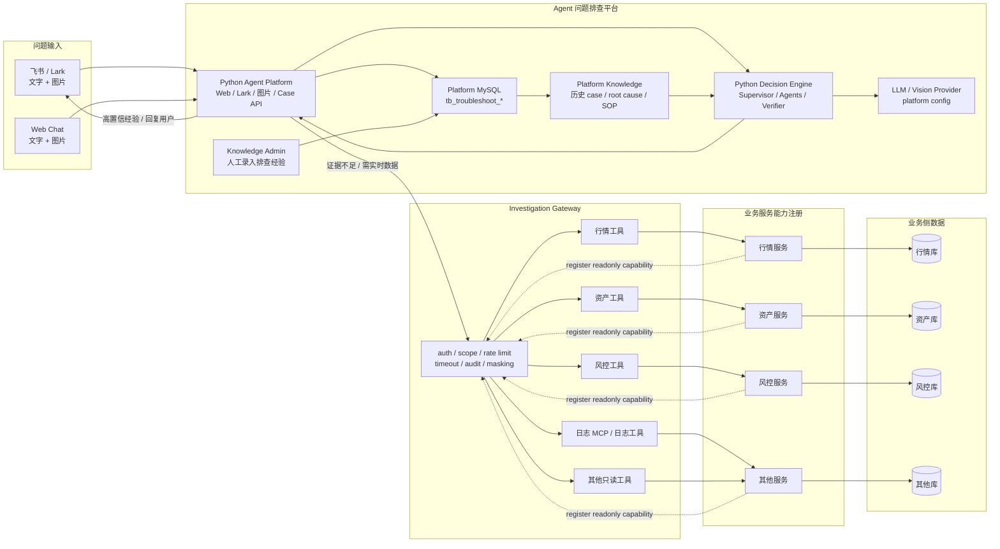

# 架构决策记录

本文档记录影响系统方向的长期决策。运行代码可以后续分阶段调整，但这里先固定共识，避免实现越走越散。

## ADR-001：决策层改为 Python，Gateway 和下游适配保持稳定

日期：2026-05-22

### 背景

Agent 编排本质上属于决策层：分类、追问、工具预算、工具计划、证据总结、停止条件和本地代码辅助排查都应由同一个决策层负责。仓库里曾经用 Go baseline runner 把一期闭环快速跑通，这块现在降级为 legacy，不作为目标主路径。目标平台入口和决策层统一放到 Python，因为后续如果要让智能体更聪明，会越来越依赖 Python 生态：

- 多模型编排，例如 Qwen-VL 识图，GPT/Claude 做文本推理。
- RAG、embedding、rerank、prompt template、eval dataset。
- LangGraph / LlamaIndex / DSPy / 自研 workflow。
- 本地 Claude Code / Cursor Agent 协助读取本地代码。
- 更快地调 prompt、调策略、做离线评测。

### 决策

平台入口和决策层迁移目标是 Python 3.13 服务。`apps/agent-platform` 是 FastAPI Agent Platform，负责 Web Chat、Lark/飞书、图片、Case API、平台 MySQL、LLM/Vision 配置和经验沉淀；`apps/decision-engine` 是目标 Agent Orchestrator，负责承接：

- case intake 后的分类、实体抽取、必要字段判断。
- 历史经验检索和相似 case 检索。
- 有限工具计划生成。
- 调用 Gateway 的只读工具。
- 总结证据、给出疑似原因和下一步建议。
- 写入 AI 决策日志，保留为什么这样判断、为什么调用这些工具、为什么停止。

Go 正式职责收敛为 `cmd/investigation-gateway`。Gateway、业务 connector、安全鉴权、审计、限流、脱敏、只读工具注册继续保持稳定，不因为决策层语言切换而改变安全边界。平台 MySQL、知识库和 LLM/Vision provider 属于 Agent 平台自己的运行依赖；业务方只提供 readonly business APIs/adapters。业务服务可以把日志、行情、资产、风控等只读能力注册到 Investigation Gateway，但 Agent 不直接连接这些服务，更不直接连接业务 DB。

目标边界：

### 约束

- Python 决策层不能直接访问生产 DB、Redis、日志平台或业务服务。
- Python 决策层只能通过 Gateway 调用已注册的只读工具。
- Gateway 返回给决策层的数据必须已经过权限校验、限流、timeout 和脱敏。
- Gateway 不查询平台 MySQL；平台 case、消息、决策日志、工具审计和 knowledge 由 Agent 平台内部服务访问。
- 决策层应先查平台历史经验并做置信度评分；只有低置信、证据不足或需要实时状态时才查 Gateway。
- 高置信经验直接返回时，必须写入决策日志，说明经验来源、分数、适用边界和未继续查下游的原因。
- 用户回复出口统一走 Case API / Channel Adapter，决策层不直接向 Lark/飞书/Web 发送消息。
- 业务服务能力通过 Gateway 注册和授权；业务服务自身再校验 Gateway 内部身份，形成双层鉴权。
- 平台数据、知识库和 LLM/Vision 由 Agent 平台统一提供；业务方不需要提供平台 MySQL 或模型接口。
- 业务方只需要提供业务只读 adapter，例如行情、资产、日志、缓存和发布记录等证据源。
- 决策层可以本地运行用于开发、联调和评测；稳定后应部署到受控环境。
- 本地代码查看只是最后手段，输出应标记为 `suspected_code_bug`，不能直接当作最终根因；证据只返回相对路径、符号、调用边、resolved symbol、receiver type 和接口实现关系，不返回源码片段。
- 任何决策链路都必须保留 tool call budget、model call budget、case timeout 和 decision logs。

### 迁移方式

当前主路径已经切到 Python Agent Platform + Go Investigation Gateway：

1. Python Agent Platform 服务 `/web`、`/web/api/*`、`/lark/events`、`/feishu/events`。
2. Python Decision Engine 内嵌在 Agent Platform 中执行 Supervisor、specialist agent 和 Verifier。
3. Go `cmd/investigation-gateway` 只服务 `/tools`、`/tools/{name}/invoke` 和受控 reload，不接 LLM。
4. Go `cmd/dev-server`、`cmd/worker`、`cmd/baseline-orchestrator`、`internal/llm`、`internal/decisionbaseline` 是历史 legacy，后续单独清理。
5. Python 决策层读取 Gateway `/tools` 或 tool catalog，不读取 Gateway 源码作为运行时依据。

## ADR-002：首发不强依赖向量数据库，先预留 RAG 接口

日期：2026-05-22

### 背景

RAG 对排障智能体有价值，但首发就引入独立向量数据库会增加部署、数据同步、权限、清理、评测和运维复杂度。当前系统的首要目标是快速定位生产问题，而不是先构建完整知识检索平台。

早期真正决定效果的通常是：

- Gateway 工具是否覆盖关键生产证据。
- case 字段是否抽取准确。
- 工具调用是否有边界、有审计、有停止条件。
- 人工回填 root cause 是否能沉淀为结构化经验。
- 决策层是否能稳定复用历史 case 和 SOP。

### 决策

首发不强依赖向量数据库。系统先实现一个抽象的 `KnowledgeRetriever` / `RAGRetriever` 接口，底层可以先用简单方案：

- MySQL / Postgres 结构化查询。
- issue domain、issue type、root cause category、owner service 标签过滤。
- SQL LIKE / full-text search。
- 最近成功 case、失败 case、人工确认 root cause。
- 手写 SOP / runbook 文档的关键词检索。

当经验库数据量、相似问题数量和 SOP 文档规模增长后，再引入向量库作为检索后端。

### 推荐分阶段

Phase 0：无向量库

- 主库继续保存 `tb_troubleshoot_case`、`tb_troubleshoot_case_message`、`tb_troubleshoot_ai_decision_log`、`tb_troubleshoot_tool_call_audit`、`tb_troubleshoot_root_cause`、`tb_troubleshoot_knowledge_item`。
- `uid` 使用 `VARCHAR(128)`，兼容数字 UID、字符串 UID 和平台外部用户 ID；模板里的通用 `status` 保留为行状态，业务状态统一放到 `case_status`、`investigation_status`、`decision_status`、`knowledge_status` 等字段。
- 决策层通过结构化条件查历史经验。
- RAG 接口存在，但实现为 SQL/tag/keyword retriever。

Phase 1：轻量向量能力

- 如果主库切 Postgres，优先用 pgvector，减少部署组件。
- 如果继续 MySQL，向量库作为旁路索引，优先考虑 Qdrant 或公司已有搜索/向量平台。
- 向量库只存可检索文本 chunk 和 embedding，不作为 case 主库。

Phase 2：完整 RAG

- 增加 embedding pipeline、chunk version、rerank、召回评测集。
- 将知识项、历史 case、SOP、工具说明、接口说明纳入统一检索。
- 检索结果必须带来源、版本、更新时间和置信度，便于审计。

### 不做什么

- 不把向量数据库当主库。
- 不用向量库保存审计日志、状态机、工具调用记录、幂等键或权限数据。
- 不让模型只凭相似 case 给最终根因。
- 不把本地代码检索结果写成未脱敏的大段源码日志。
- 不把 tree-sitter、LSP 或 LSIF 后端结果绕过 Local Code Agent 的安全契约直接暴露给用户。

### 引入向量库的触发条件

满足以下任意条件，再正式引入向量库：

- `tb_troubleshoot_knowledge_item` 超过几百条，关键词检索明显召回不足。
- 历史 case 超过几千条，需要相似 case 聚类。
- SOP / runbook 文档较多，人工维护标签成本变高。
- 离线评测显示向量召回能显著提升定位准确率。
- 公司已有稳定向量平台，可以低成本接入。

结论：先把 RAG 设计成接口，不把向量库做成首发依赖。这样系统一开始更简单，后续又不会堵住智能化演进路线。
