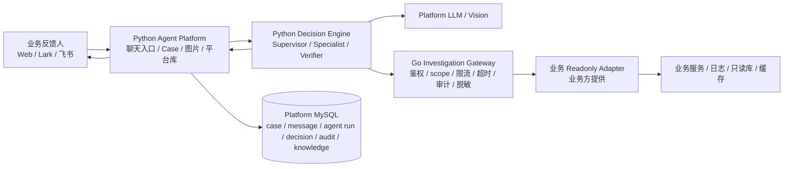

# 业务方从零接入手册

这份文档给第一次接入 `ai-troubleshooter` 的业务团队、平台工程师，以及业务方自己的 AI 使用。目标是让业务方只需要提供安全的只读接口或 MCP readonly adapter，平台方配置好 MySQL、LLM、Gateway 和 Web Chat 后，就能通过自然语言排查问题。

如果你只记一件事：**业务方不提供 LLM，不提供平台 MySQL，不让 Agent 直连业务 DB。业务方只提供受控 readonly evidence API。**

## 1. 最小可用流程



从接入方视角，按这个顺序做：

1. 平台方初始化平台 MySQL 并启动 Agent Platform。
2. 平台方配置 Qwen、GPT、Claude Code 或公司统一模型网关。
3. 平台方启动 Investigation Gateway，并开启 Bearer、scope、限流和控制面鉴权。
4. 业务方实现 readonly adapter，只暴露查询接口。
5. 业务方提交或在 Web 录入能力 manifest。
6. 平台方发布能力，Gateway reload 后 Web Chat 就能调用这些工具。
7. 用真实问题从 Web Chat 发起排查，并在 MySQL、Gateway audit、adapter 日志里验证。

## 2. 服务职责

| 服务 | 语言 | 谁维护 | 必须运行吗 | 作用 |
| --- | --- | --- | --- | --- |
| Agent Platform | Python 3.13 / FastAPI | Agent 平台 | 是 | Web Chat、Lark/飞书入口、图片接收、Case API、平台 MySQL、LLM/Vision 配置、orchestrator 主路径、经验沉淀。 |
| Decision Engine | Python 3.13 | Agent 平台 | 通常由 Agent Platform 调用 | Supervisor、specialist agents、Knowledge Agent、Verifier、工具计划、停止条件、本地代码辅助排查。 |
| Investigation Gateway | Go 1.24+ | Agent 平台 | 是 | 统一接业务只读证据，做 Bearer、agent/scope/tool/chat allowlist、限流、timeout、审计、脱敏。 |
| Readonly Adapter | 任意语言 | 业务方 | 业务接入时是 | 查询业务证据，例如日志、用户资料、订单、资产、推荐状态、缓存状态。 |
| MCP Readonly Adapter | Python / 任意语言 | 平台或业务方 | 可选 | 把业务已有 MCP server 映射成受控 readonly HTTP contract。 |

边界必须保持清楚：

- LLM/Vision 只在 Python Agent Platform 配置。
- 排障编排和 Agent Team 在 Python Decision Engine。
- Go 只做 Investigation Gateway，不放 LLM、图片理解、Web Chat、Lark bot 或决策逻辑。
- 平台 MySQL 是 Agent 平台自己的数据库，业务方不需要提供。
- 业务生产 DB 由业务服务或 adapter 自己读取，Agent 和 Gateway 不直连。

## 3. 业务方需要准备什么

业务方需要准备：

| 项目 | 说明 |
| --- | --- |
| 服务名 | 和日志、部署、代码仓一致，例如 `health-food`、`asset-service`。 |
| 只读证据清单 | 例如用户是否存在、订单状态、推荐任务状态、日志摘要、缓存状态。 |
| Readonly adapter | 一个内部 HTTP 服务，路径必须包含 `/readonly/`，只允许查询。 |
| Manifest | 声明服务、base URL、tool、scope、参数、超时、限流和数据分级。 |
| Adapter token | 业务 adapter 自己校验 Gateway 请求的 Bearer token，真实 token 只放环境变量或密钥系统。 |
| 验收用例 | 真实 uid、订单号、时间范围、预期结果和证据来源。 |

业务方不需要准备：

- 不需要提供 LLM API key。
- 不需要提供平台 case/knowledge 数据库。
- 不需要把业务 DB 账号交给 Agent。
- 不需要让用户填写内部字段名或精确 SQL 条件。

## 4. 平台建表和数据库配置

平台侧需要一个 MySQL 库，例如 `ai_troubleshooter`。运行 migration：

```bash
python3.13 -m venv .venv
.venv/bin/python -m pip install -e apps/agent-platform

MYSQL_HOST=127.0.0.1 \
MYSQL_PORT=3306 \
MYSQL_USER="$LOCAL_MYSQL_USER" \
MYSQL_PASSWORD="$LOCAL_MYSQL_PASSWORD" \
MYSQL_DATABASE=ai_troubleshooter \
make migrate-mysql
```

本地开发和验收也固定使用 `ai_troubleshooter`。不要为每次接入、每个 Program 或每个业务 adapter 创建新的 `ai_troubleshooter_*` 平台库；如果确实需要隔离实验，必须显式设置 `ALLOW_NON_CANONICAL_LOCAL_DB=true`，并在当前 Program 记录清理计划。生产/预发可以按公司规范使用独立环境库名。

运行时可以使用 `MYSQL_*`：

```bash
export DB_DRIVER=mysql
export MYSQL_HOST=127.0.0.1
export MYSQL_PORT=3306
export MYSQL_USER="$LOCAL_MYSQL_USER"
export MYSQL_PASSWORD="$LOCAL_MYSQL_PASSWORD"
export MYSQL_DATABASE=ai_troubleshooter
```

也可以使用 Go 风格 DSN：

```bash
export DB_DRIVER=mysql
export DB_DSN='ai_user:replace-with-password@tcp(127.0.0.1:3306)/ai_troubleshooter?parseTime=true&loc=Local'
```

`DB_DRIVER=memory` 只能用于一次性 smoke，不能作为持久化验收。

平台表用途：

| 表 | 写入方 | 用途 |
| --- | --- | --- |
| `tb_troubleshoot_case` | Agent Platform | 排障 case 主表，保存标题、来源、状态、uid、优先级等。 |
| `tb_troubleshoot_case_message` | Agent Platform | 用户消息、AI 回复、图片 OCR/视觉摘要等消息记录。 |
| `tb_troubleshoot_case_entity` | Agent Platform | 从自然语言提取的 uid、service、symbol、时间等实体。 |
| `tb_troubleshoot_investigation` | Agent Platform / Decision Engine | 一次排查运行的状态、耗时、停止原因和总结。 |
| `tb_troubleshoot_ai_decision_log` | Agent Platform / Decision Engine | AI 为什么这么判断、为什么调用工具、为什么停止。 |
| `tb_troubleshoot_agent_runtime` | Agent Platform | 本地或云端 Agent runtime 注册、provider 列表、workspace 和心跳。 |
| `tb_troubleshoot_agent_run` | Agent Platform / Decision Engine | Supervisor、specialist、Knowledge、Verifier、local-code 等一次子任务运行记录。 |
| `tb_troubleshoot_agent_run_event` | Agent Platform / Decision Engine | 子任务内的分类、经验检索、工具计划、工具执行、验证和停止事件。 |
| `tb_troubleshoot_context_ledger` | Agent Platform / Decision Engine | 上下文压缩摘要、证据引用和 specialist report，避免主 Agent 上下文膨胀。 |
| `tb_troubleshoot_tool_call_audit` | Investigation Gateway | 工具调用审计、policy decision、耗时、错误、脱敏后的摘要。 |
| `tb_troubleshoot_knowledge_item` | Agent Platform | 平台经验沉淀，可以人工录入、预览、编辑、删除。 |
| `tb_troubleshoot_root_cause` | Agent Platform | 人工确认的根因和解决动作。 |
| `tb_troubleshoot_case_feedback` | Agent Platform | 人工反馈、是否解决、评分、改进建议。 |
| `tb_troubleshoot_knowledge_evolution_run` | Agent Platform | 经验自进化任务运行记录。 |
| `tb_troubleshoot_business_service` | Agent Platform | Web 录入或 manifest 导入的业务服务。 |
| `tb_troubleshoot_tool_registry` | Agent Platform / Gateway | 动态 readonly tool 注册表。 |
| `tb_troubleshoot_mcp_server` | Agent Platform | 外部 MCP readonly 配置登记。 |
| `tb_troubleshoot_tool_validation_run` | Agent Platform | 能力接入验证运行记录。 |
| `tb_troubleshoot_web_case_session` | Agent Platform | Web 会话标题、草稿、来源和状态。 |

业务方不要直接写这些表。业务方只通过 adapter 被 Gateway 调用。

## 5. LLM 和 Vision 怎么配置

LLM/Vision 只在 Python Agent Platform 配置。Go Gateway 不需要任何模型配置。

真实验收建议显式关闭规则兜底：

```bash
export LLM_ALLOW_RULE_FALLBACK=false
```

### 5.1 Qwen / DashScope

```bash
export AI_MODEL_PROFILE=qwen
export DASHSCOPE_API_KEY="$DASHSCOPE_API_KEY"
export QWEN_MODEL=qwen-plus
export QWEN_VISION_MODEL=qwen-vl-plus
```

### 5.2 GPT / OpenAI

```bash
export AI_MODEL_PROFILE=gpt
export OPENAI_API_KEY="$OPENAI_API_KEY"
export OPENAI_MODEL=gpt-4.1-mini
export OPENAI_VISION_MODEL=gpt-4.1-mini
```

### 5.3 Claude / Anthropic

```bash
export AI_MODEL_PROFILE=claude
export ANTHROPIC_API_KEY="$ANTHROPIC_API_KEY"
export ANTHROPIC_MODEL=claude-sonnet-4-5
```

### 5.4 Claude Code 或本地模型代理

如果公司已经把 Claude Code、Cursor Agent 或内部模型代理封装成 OpenAI-compatible / Anthropic-compatible HTTP 服务，可以这样配：

```bash
export AI_MODEL_PROFILE=claude_code
export CLAUDE_CODE_BASE_URL=http://127.0.0.1:19093
export CLAUDE_CODE_API_KEY="$LOCAL_PROXY_TOKEN"
export CLAUDE_CODE_MODEL=replace-with-proxy-model
```

### 5.5 本地 Claude Code / Codex 作为决策 advisor

业务方通常不需要配置本地 agent；这是平台方本地调试和增强决策层的能力。平台方机器已经安装 Claude Code 或 Codex CLI 时，推荐在 Web 右侧“本地决策 Agent”点击“发现”，再启用 Codex/Claude Code。启用后不需要重启 Agent Platform，下一个 case 会动态把它作为 `llm_decision_agent` advisor。

无 Web 的 headless 场景才需要用环境变量强制指定：

```bash
export AI_MODEL_PROFILE=local_agent
export LOCAL_AGENT_PROVIDER=codex        # auto / codex / claude_code
export LOCAL_AGENT_WORKSPACE_ROOT="$PWD"
export DECISION_LLM_ENABLED=true
export LLM_TIMEOUT_SECONDS=30
```

启动 Agent Platform 后，也可用 API 发现和启用：

```bash
curl -s http://localhost:19091/api/v1/local-agents/discover
curl -s -X POST http://localhost:19091/api/v1/local-agents/enable \
  -H 'Content-Type: application/json' \
  -d '{"provider_id":"codex","enabled":true}'
```

本地 agent 只作为 Python Decision Engine 的 `llm_decision_agent` advisor；Agent Run 会记录 `model_provider=local_agent`、`model_name=codex` 或对应 provider。Verifier 仍会校验可用工具、调用预算和 Gateway-only 边界。平台不会读取本地 agent 配置里的 token/key，也不允许本地 agent 直接查询生产 DB 或自动修改业务代码。

### 5.6 公司统一模型网关

```bash
export LLM_PROVIDER=openai_compatible
export LLM_BASE_URL=https://llm-gateway.example.internal/v1
export LLM_API_KEY="$MODEL_GATEWAY_TOKEN"
export LLM_MODEL=replace-with-approved-model
```

### 5.7 图片识别模型

默认情况下：

- `AI_MODEL_PROFILE=qwen` 会使用 Qwen-VL。
- `AI_MODEL_PROFILE=gpt` 会使用 OpenAI vision-capable 模型。
- 如果主模型和图片模型想分开，可以显式设置 `VISION_*`。

```bash
export VISION_PROVIDER=qwen_openai_compatible
export VISION_BASE_URL=https://dashscope.aliyuncs.com/compatible-mode/v1
export VISION_API_KEY="$DASHSCOPE_API_KEY"
export VISION_MODEL=qwen-vl-plus
export VISION_MAX_IMAGES_PER_MESSAGE=3
export VISION_MAX_IMAGE_BYTES=10485760
```

不要把 API key 写进 Git、manifest、README 或截图。推荐放在 `.env`、本机 shell、Secret Manager 或部署平台密钥中。

## 6. 启动哪些服务

### 6.1 启动 Investigation Gateway

本地开发：

```bash
export HTTP_PORT=18080
export DB_DRIVER=mysql
export DB_DSN="$LOCAL_DB_DSN"
export CONNECTOR_MODE=mock
make gateway
```

接真实 HTTP adapter：

```bash
export HTTP_PORT=18080
export DB_DRIVER=mysql
export DB_DSN="$LOCAL_DB_DSN"
export CONNECTOR_MODE=http
export CONNECTOR_API_KEY="$CONNECTOR_API_KEY"
export CONNECTOR_TIMEOUT_SECONDS=5
export HEALTH_FOOD_READONLY_BASE_URL=http://127.0.0.1:19081
make gateway
```

生产或预发建议开启 Gateway 鉴权：

```bash
export GATEWAY_AUTH_ENABLED=true
export GATEWAY_AGENT_CONFIG_FILE=configs/gateway-agents.example.json
export BUSINESS_TROUBLESHOOTER_GATEWAY_TOKEN="$RANDOM_LONG_TOKEN"
```

### 6.2 启动 Agent Platform

```bash
export AGENT_PLATFORM_PORT=19091
export DB_DRIVER=mysql
export DB_DSN="$LOCAL_DB_DSN"
export GATEWAY_ENDPOINT=http://127.0.0.1:18080
export GATEWAY_AGENT_ID=business-troubleshooter-v1
export GATEWAY_BEARER_TOKEN="$BUSINESS_TROUBLESHOOTER_GATEWAY_TOKEN"

export AI_MODEL_PROFILE=qwen
export DASHSCOPE_API_KEY="$DASHSCOPE_API_KEY"
export QWEN_MODEL=qwen-plus
export QWEN_VISION_MODEL=qwen-vl-plus

make dev
```

打开：

```text
http://localhost:19091/web
```

Agent Platform 的常用 API：

| API | 用途 |
| --- | --- |
| `GET /healthz` | 健康检查。 |
| `GET /web` | Web Chat 工作台。 |
| `POST /api/v1/chat` | 创建或继续排障对话，支持文字和图片。 |
| `GET /api/v1/cases/{case_ref}` | 查询 case 详情和进度。 |
| `GET /api/v1/knowledge` | 查询平台经验。 |
| `POST /api/v1/knowledge` | 录入平台经验。 |
| `GET /api/v1/capabilities` | 查询已录入业务能力。 |
| `POST /api/v1/capabilities/import` | 导入业务能力 manifest。 |
| `POST /api/v1/capabilities/{id}/publish` | 发布某个能力并触发 Gateway reload。 |
| `GET /api/v1/agent-runtimes` | 查看已注册本地或云端 Agent runtime。 |
| `POST /api/v1/agent-runtimes/register` | 注册本地 runtime，例如 Codex、Claude Code 或 Cursor 只读辅助。 |
| `POST /api/v1/agent-runtimes/{runtime_id}/heartbeat` | 更新 runtime 在线状态。 |
| `POST /lark/events` / `POST /feishu/events` | Lark/飞书回调入口。 |

### 6.3 Decision Engine 是否单独启动

正常 Web Chat 场景不要求业务方单独启动一个外部 Decision Engine 服务，但排查必须经过 Decision Engine。Agent Platform 会在同一个 Python 进程内加载 `apps/decision-engine`，并在每个 case 的 `process_case()` 中调用 `DecisionEngine.plan(request)`。

因此主路径是：

```text
Web Chat / Lark / Feishu
  -> Agent Platform
  -> DecisionEngine.plan()
  -> Supervisor / Specialist Agents / Knowledge Agent / Local Code Agent / Verifier
  -> 按决策结果询问用户、复用经验、调用 Gateway tools，或进入本地代码辅助排查
```

判断是否真的经过 Decision Engine，可以看平台 MySQL 的 `tb_troubleshoot_ai_decision_log`：正常排查会有 `decision_type=orchestrator_plan`，`reason` 通常包含 `Python Supervisor selected next action and verifier checked tool budget/safety`。

同时也可以看 `GET /api/v1/cases/{case_ref}` 返回的 `agent_runs`：正常排查会包含 `supervisor`，并按实际场景包含 `knowledge_agent`、业务 specialist 和 `verifier`。这些记录来自平台 MySQL 的 `tb_troubleshoot_agent_run` 和 `tb_troubleshoot_agent_run_event`。

需要调试协议时可以单独启动：

```bash
make decision-engine
```

这只用于调试 Decision Engine HTTP/CLI 协议，不是业务方接入或 Web Chat 必需进程，也不改变架构边界。

## 7. Gateway 鉴权、scope 和 Bearer 配置

Agent Platform 调 Gateway 时会带：

```text
Authorization: Bearer ${GATEWAY_BEARER_TOKEN}
```

Gateway 根据 token 解析可信 `agent_id`，再校验 tool、scope、chat allowlist、限流和参数边界。

推荐 agent 配置：

```json
{
  "agents": [
    {
      "agent_id": "business-troubleshooter-v1",
      "status": "enabled",
      "bearer_token_env": "BUSINESS_TROUBLESHOOTER_GATEWAY_TOKEN",
      "allowed_scopes": [
        "health_food:user:read",
        "health_food:recommendation:read",
        "logs:read_summary"
      ],
      "allowed_tools": [
        "get_health_food_user_profile",
        "get_health_food_recommendation_status",
        "search_logs_by_service"
      ],
      "allowed_chat_ids": ["oc_health_food_oncall"],
      "rate_limit_qps": 5
    }
  ]
}
```

启动 Gateway：

```bash
export GATEWAY_AUTH_ENABLED=true
export GATEWAY_AGENT_CONFIG_FILE=configs/gateway-agents.example.json
export BUSINESS_TROUBLESHOOTER_GATEWAY_TOKEN="$RANDOM_LONG_TOKEN"
```

启动 Agent Platform：

```bash
export GATEWAY_BEARER_TOKEN="$BUSINESS_TROUBLESHOOTER_GATEWAY_TOKEN"
export GATEWAY_AGENT_ID=business-troubleshooter-v1
```

动态能力发布需要 Gateway 控制面 reload。生产建议控制面 token 和 Gateway 调用 token 分开：

```bash
export CONTROL_API_AUTH_ENABLED=true
export CONTROL_API_BEARER_TOKENS="$CONTROL_TOKEN"
export GATEWAY_ADMIN_BEARER_TOKEN="$CONTROL_TOKEN"
```

## 8. 业务方如何写 readonly adapter

adapter 的核心职责是：把业务内部系统、日志平台、只读库、缓存或第三方查询封装成标准 HTTP JSON 查询接口。

### 8.1 路径和方法

路径必须包含 `/readonly/`，建议统一：

```text
POST /v1/readonly/{service}/{domain}/{action}
```

示例：

```text
POST /v1/readonly/health-food/user/profile
POST /v1/readonly/health-food/recommendation/status
POST /v1/readonly/asset-service/user/snapshot
POST /v1/readonly/ops/logs/search
```

禁止这类危险路径：

```text
/delete
/update
/write
/execute
/restart
/refund
/transfer
/grant
/revoke
```

### 8.2 请求头

Gateway 调 adapter 时会发送：

```text
Authorization: Bearer ${CONNECTOR_API_KEY}
Content-Type: application/json
X-Request-Id: req_xxx
X-Case-Id: case_20260525_000001
X-Agent-Id: business-troubleshooter-v1
X-Caller-User-Id: web_user
X-Tool-Name: get_health_food_recommendation_status
```

adapter 必须校验 Bearer token，并记录这些审计字段。

### 8.3 请求 envelope

所有 adapter 接口请求体统一：

```json
{
  "request_id": "req_xxx",
  "case_id": "case_20260525_000001",
  "agent_id": "business-troubleshooter-v1",
  "caller_user_id": "web_user",
  "tool_name": "get_health_food_recommendation_status",
  "timeout_ms": 5000,
  "params": {
    "uid": "hf-user-001",
    "recommendation_date": "2026-05-25"
  }
}
```

### 8.4 成功响应 envelope

```json
{
  "request_id": "req_xxx",
  "source": "health-food-readonly-api",
  "queried_at": "2026-05-25T12:00:00+08:00",
  "data_updated_at": "2026-05-25T11:59:00+08:00",
  "version": "v1",
  "data": {
    "uid": "hf-user-001",
    "has_recommendation": false,
    "job_status": "failed",
    "failure_reason": "meal fingerprint did not refresh"
  },
  "warnings": []
}
```

`data` 只放定位问题需要的摘要和证据字段，不返回完整日志、完整 prompt、完整 token、完整手机号、完整邮箱或完整第三方 open_id。

### 8.5 错误响应

HTTP 状态码建议：

| 状态码 | 场景 |
| --- | --- |
| `400` | 参数错误。 |
| `401` | adapter Bearer 鉴权失败。 |
| `403` | 调用方无权限。 |
| `408` | 底层查询超时。 |
| `429` | adapter 或下游限流。 |
| `500` | adapter 内部错误。 |
| `503` | 底层业务服务不可用。 |

错误体：

```json
{
  "code": "TIME_RANGE_TOO_LARGE",
  "error": "time range exceeds 30 minutes"
}
```

### 8.6 实现硬规则

- 只能查询，禁止写、删、改、执行脚本、重启服务、发起支付或退款。
- DB 查询必须使用 ORM、Query Builder 或参数绑定。
- 禁止把用户输入拼进 SQL、shell、日志平台 DSL 或 Redis key pattern。
- 动态字段、排序、表名、状态枚举必须用代码内白名单。
- 每个查询必须有 timeout、limit 和时间范围上限。
- 用户 UID 可以是字符串，不能假设是数字。
- 返回前必须脱敏手机号、邮箱、token、secret、身份证、完整 open_id、支付凭证、模型 key。
- 每次调用必须记录 `request_id`、`case_id`、`agent_id`、`tool_name`、耗时和错误码。
- adapter 不要把真实 token 写进 manifest，只写 `token_env` 或 `secret_ref`。

### 8.7 最小 FastAPI adapter 示例

下面只是结构示例，真实查询要放到业务仓库里，并使用业务自己的 repository/DAO：

```python
from fastapi import FastAPI, Header, HTTPException
from pydantic import BaseModel, Field
from datetime import datetime, timezone

app = FastAPI()

class ReadonlyRequest(BaseModel):
    request_id: str
    case_id: str
    agent_id: str
    caller_user_id: str | None = None
    tool_name: str
    timeout_ms: int = Field(default=5000, le=10000)
    params: dict

@app.post("/v1/readonly/health-food/recommendation/status")
def recommendation_status(req: ReadonlyRequest, authorization: str = Header(default="")):
    if authorization != "Bearer " + get_connector_api_key():
        raise HTTPException(status_code=401, detail="unauthorized")
    uid = str(req.params.get("uid", "")).strip()
    recommendation_date = str(req.params.get("recommendation_date", "")).strip()
    if not uid or not recommendation_date:
        raise HTTPException(status_code=400, detail="uid and recommendation_date are required")

    # 使用业务 repository 参数绑定查询，不要拼接 SQL。
    row = query_recommendation_status(uid=uid, recommendation_date=recommendation_date)
    now = datetime.now(timezone.utc).astimezone().isoformat()
    return {
        "request_id": req.request_id,
        "source": "health-food-readonly-api",
        "queried_at": now,
        "data_updated_at": row.get("updated_at") or now,
        "version": "v1",
        "data": {
            "uid": uid,
            "has_recommendation": row.get("has_recommendation", False),
            "job_status": row.get("job_status", "unknown"),
            "failure_reason": row.get("failure_reason"),
        },
        "warnings": [],
    }
```

## 9. 写完接口后怎么接入 Gateway

业务方提供 manifest。平台可以通过 Web 工作台“能力接入”录入，也可以调用 API 导入。

### 9.1 Manifest 示例

```yaml
service:
  service_name: health-food
  owner_team: health
  runtime: spring-boot
  environment: prod
  base_url: https://health-food-readonly.internal
  health_check:
    method: GET
    path: /healthz
  auth:
    type: bearer
    token_env: CONNECTOR_API_KEY
  data_classification:
    contains_user_data: true
    contains_financial_data: false
    contains_health_data: true
    pii_level: internal_sensitive
  contacts:
    primary: health-food-oncall
capabilities:
  - tool_name: get_health_food_user_profile
    description: 查询 health-food 用户资料、会员等级、健康目标和最近设备摘要。
    scope: health_food:user:read
    method: POST
    path: /v1/readonly/health-food/user/profile
    timeout_ms: 5000
    max_qps: 5
    max_time_range_minutes: 0
    max_limit: 1
    sensitivity_level: sensitive
    required_params:
      - uid
    optional_params:
      - trace_id
    response_data_schema_ref: HealthFoodUserProfile
  - tool_name: get_health_food_recommendation_status
    description: 查询 health-food 每日推荐生成状态、输入餐食和失败原因。
    scope: health_food:recommendation:read
    method: POST
    path: /v1/readonly/health-food/recommendation/status
    timeout_ms: 5000
    max_qps: 5
    max_time_range_minutes: 1440
    max_limit: 1
    sensitivity_level: sensitive
    required_params:
      - uid
      - recommendation_date
    optional_params:
      - start_time
      - end_time
      - trace_id
    response_data_schema_ref: HealthFoodRecommendationStatus
```

### 9.2 Web 录入

1. 打开 `http://localhost:19091/web`。
2. 找到能力接入或 Gateway Tools 区域。
3. 粘贴 manifest。
4. 保存后先是 draft 或 needs_review。
5. 发布能力。
6. 确认左侧 Gateway Tools 按服务分组出现新工具。

Web 录入不会绕过安全策略。工具名、描述、scope、method、path 中出现危险写操作信号，或 path 不含 `/readonly/`，会被拒绝或要求人工 review。

### 9.3 API 导入

```bash
curl -s -X POST http://127.0.0.1:19091/api/v1/capabilities/import \
  -H 'Content-Type: application/yaml' \
  --data-binary @configs/business-capabilities.health-food.example.yaml
```

查询导入结果：

```bash
curl -s http://127.0.0.1:19091/api/v1/capabilities
```

发布某个能力：

```bash
curl -s -X POST http://127.0.0.1:19091/api/v1/capabilities/{capability_id}/publish
```

发布后 Agent Platform 会调用 Gateway：

```text
POST /admin/capabilities/reload
```

如果开启控制面鉴权，必须设置：

```bash
export CONTROL_API_AUTH_ENABLED=true
export CONTROL_API_BEARER_TOKENS="$CONTROL_TOKEN"
export GATEWAY_ADMIN_BEARER_TOKEN="$CONTROL_TOKEN"
```

### 9.4 让 agent 真正可调用

动态能力发布后，还要确保 Gateway agent 拥有对应 scope 和 tool：

```json
{
  "agent_id": "business-troubleshooter-v1",
  "allowed_scopes": ["health_food:recommendation:read"],
  "allowed_tools": ["get_health_food_recommendation_status"]
}
```

如果本地 demo 使用 `allowed_tools: ["*"]`，仍然要确保 tool 已发布、scope 允许、参数边界通过。

## 10. 验收怎么做

验收必须按证据等级写清楚。mock、memory、local_rules 只能证明页面和契约，不能证明真实业务排障。

### 10.1 服务健康检查

```bash
curl -s http://127.0.0.1:18080/healthz
curl -s http://127.0.0.1:19091/healthz
curl -s http://127.0.0.1:18080/tools
```

如果 Gateway 开启鉴权且不允许匿名 list tools，需要带 token：

```bash
curl -s http://127.0.0.1:18080/tools \
  -H "Authorization: Bearer $BUSINESS_TROUBLESHOOTER_GATEWAY_TOKEN"
```

### 10.2 直接调用业务 adapter

```bash
curl -s -X POST http://127.0.0.1:19081/v1/readonly/health-food/recommendation/status \
  -H "Authorization: Bearer $CONNECTOR_API_KEY" \
  -H 'Content-Type: application/json' \
  -d '{
    "request_id": "req_manual_001",
    "case_id": "case_manual_001",
    "agent_id": "business-troubleshooter-v1",
    "caller_user_id": "web_user",
    "tool_name": "get_health_food_recommendation_status",
    "timeout_ms": 5000,
    "params": {
      "uid": "hf-user-001",
      "recommendation_date": "2026-05-25"
    }
  }'
```

预期：

- HTTP 200。
- 返回标准 envelope。
- adapter 自身日志能查到 `request_id`。
- 结果来自真实只读数据源，不是代码写死。

### 10.3 通过 Gateway 调工具

```bash
curl -s -X POST http://127.0.0.1:18080/tools/get_health_food_recommendation_status/invoke \
  -H "Authorization: Bearer $BUSINESS_TROUBLESHOOTER_GATEWAY_TOKEN" \
  -H 'Content-Type: application/json' \
  -d '{
    "case_id": "case_manual_002",
    "agent_id": "business-troubleshooter-v1",
    "caller_user_id": "web_user",
    "arguments": {
      "uid": "hf-user-001",
      "recommendation_date": "2026-05-25"
    }
  }'
```

预期：

- Gateway policy allow。
- `tb_troubleshoot_tool_call_audit` 有审计记录。
- 超时、限流、scope deny 等 case 能按预期返回。

### 10.4 通过 Web Chat 发起真实问题

用户应该自然描述，不需要懂内部参数：

```text
uid 123456 今天没有每日推荐，帮我查一下原因
```

或者：

```text
用户 123456 反馈推荐不准，好像没有按照减脂目标推荐
```

Agent 应该做的事：

- 从自然语言里提取 uid、问题类型、时间范围。
- 缺少关键字段时追问，例如 uid 为空或用户不存在。
- 先查平台经验，再按预算调用 Gateway readonly tools。
- 工具证据不足时说明证据缺口，不编造结论。
- 得到足够证据后输出根因、证据、建议动作。
- 记录 AI 决策日志和工具审计。

### 10.5 MySQL 验证查询

```sql
SELECT case_no, case_status, uid, source, create_time
FROM tb_troubleshoot_case
ORDER BY id DESC
LIMIT 5;

SELECT message_role, LEFT(message_text, 120) AS message_preview, create_time
FROM tb_troubleshoot_case_message
WHERE case_id = ?
ORDER BY id ASC;

SELECT decision_type, decision_status, LEFT(reasoning_summary, 160) AS reasoning_preview, create_time
FROM tb_troubleshoot_ai_decision_log
WHERE case_id = ?
ORDER BY id ASC;

SELECT tool_name, policy_decision, latency_ms, error_code, create_time
FROM tb_troubleshoot_tool_call_audit
WHERE case_id = ?
ORDER BY id ASC;
```

验收通过至少要证明：

- Web 或 API 创建了 case。
- 消息写入平台 MySQL。
- AI 决策日志写入平台 MySQL。
- Gateway 工具审计写入平台 MySQL。
- 业务 adapter 被真实调用。
- 结果能解释用户问题，或明确说出还缺哪类证据。

## 11. Lark / 飞书接入位置

Lark/飞书入口也在 Python Agent Platform，不在 Go Gateway。

常用配置：

```bash
export LARK_PLATFORM=lark
export LARK_APP_ID="$LARK_APP_ID"
export LARK_APP_SECRET="$LARK_APP_SECRET"
export LARK_VERIFICATION_TOKEN="$LARK_VERIFICATION_TOKEN"
export LARK_ENCRYPT_KEY="$LARK_ENCRYPT_KEY"
export LARK_ALLOWED_CHAT_IDS=oc_health_food_oncall,oc_prod_support
```

飞书中国站可配置：

```bash
export LARK_PLATFORM=feishu
```

启用 `LARK_ENCRYPT_KEY` 后，平台只接受 encrypted callback。图片消息需要 `LARK_APP_ID/LARK_APP_SECRET` 下载资源，然后交给 Python Vision provider 识别。

本手册优先覆盖 Web Chat 接入。Lark/飞书真实验收需要公司 bot 凭据、回调地址、群 allowlist 和外部平台送达证据。

## 12. 直接给业务方 AI 的任务提示

可以把下面这段直接交给业务方自己的 AI：

```text
你要在当前业务仓库中为 ai-troubleshooter 实现一个 readonly adapter。

硬约束：
1. 只能提供查询接口，禁止写、删、改、执行脚本、重启服务、发起退款或转账。
2. 所有 endpoint 必须位于 /v1/readonly/{service}/...。
3. 请求和响应必须遵守 docs/business-onboarding-quickstart.md 的 envelope。
4. 必须校验 Authorization: Bearer ${CONNECTOR_API_KEY}。
5. 每次调用必须记录 request_id、case_id、agent_id、tool_name、耗时和错误码。
6. DB 查询必须使用 ORM、Query Builder 或参数绑定，不允许字符串拼接 SQL。
7. 必须设置 timeout、limit 和时间范围上限。
8. 返回前必须脱敏手机号、邮箱、token、secret、身份证、完整 open_id、支付凭证和模型 key。
9. 不要把真实 token、DB 密码、API key 写入代码、manifest 或测试截图。

请做这些事：
1. 阅读业务系统已有代码和数据模型，找出能支持排障的只读数据源。
2. 设计 3 到 8 个 readonly tools，每个 tool 给出 tool_name、description、scope、required_params、optional_params、response schema。
3. 实现 adapter endpoint。
4. 编写 manifest，service_name 使用真实部署服务名，base_url 指向 adapter 地址，auth 只写 token_env 或 secret_ref。
5. 写 adapter 单测，覆盖成功、参数错误、未授权、超时、时间范围过大、脱敏。
6. 本地启动 adapter，使用 curl 真实调用成功。
7. 把 manifest 交给 Agent 平台导入发布，再通过 Gateway 调 tool 验证。
8. 最后从 Web Chat 用自然语言问题验证完整链路，并记录证据。
```

## 13. 常见问题

### 为什么用户不用提供完整时间格式

用户可以说“今天”“昨天晚上”“刚才”“UTC+8 下午 3 点左右”。Agent 应该结合默认 timezone、消息时间和业务上下文推断时间窗。只有无法定位时才追问，不应该要求用户输入内部格式。

### 为什么我录入的工具没有出现在 Web 左侧

检查：

- capability 是否已发布，不只是 draft。
- path 是否包含 `/readonly/`。
- tool name、description、scope 是否触发危险写操作判定。
- Gateway reload 是否成功。
- Gateway agent 是否允许该 scope 和 tool。
- Web 是否刷新了工作台。

### 为什么 Gateway 返回 401

检查：

- Agent Platform 是否设置 `GATEWAY_BEARER_TOKEN`。
- Gateway 是否设置 `GATEWAY_AUTH_ENABLED=true`。
- `GATEWAY_AGENT_CONFIG_FILE` 中 `bearer_token_env` 对应环境变量是否有值。
- curl 是否带了 `Authorization: Bearer ...`。

### 为什么 Gateway 返回 403

常见原因：

- token 解析出的 agent_id 和请求体 agent_id 不一致。
- agent 没有该 tool 或 scope。
- chat/user 不在 allowlist。
- tool 未发布或被禁用。

### 为什么真实 adapter 没被调用

检查：

- Gateway 是否用 `CONNECTOR_MODE=http`。
- 对应 `*_READONLY_BASE_URL` 是否指向真实 adapter。
- tool 是否是动态注册工具，base URL 是否写在 manifest 里。
- adapter 是否通过 `/healthz`。
- Gateway audit 中是否有 deny 或 timeout。

### 能不能直接让 Agent 查业务 DB

不能。生产排障必须通过业务 readonly adapter、日志平台 readonly API、DMS MCP 或受控 MCP readonly adapter。Agent 和 Gateway 都不应直接拿业务 DB 密码。

### 能不能用 local_rules 验收

只能做页面入口 smoke。`local_rules` 不能进入生产排障；未启用真实决策 Agent 时，平台会在查询 Gateway、平台经验和工具调用前阻断。真实排障验收必须接真实 Qwen/GPT/Claude/公司模型网关，并关闭规则兜底：

```bash
export LLM_ALLOW_RULE_FALLBACK=false
```

### 接入 MCP 怎么办

如果业务方已经有 MCP server，不让 Decision Engine 直接连生产 MCP。先用 MCP readonly adapter 把 MCP tool 映射成本文档的 HTTP readonly contract，再录入 manifest。这样 Gateway 仍然能做鉴权、scope、限流、timeout、审计和脱敏。

## 14. 推荐阅读顺序

新手按这个顺序看：

1. 本文档。
2. [业务服务能力注册规范](business-service-registration.md)。
3. [AI 接入规范：业务只读接口封装](ai-connector-integration.md)。
4. [Gateway 安全与鉴权边界](gateway-security.md)。
5. [本地运行手册](local-runbook.md)。
6. [Web 工作台说明](web-workbench.md)。

需要生产上线前，再看：

- [部署检查清单](deployment-checklist.md)
- [决策日志与查询限制](decision-logging-and-limits.md)
- [知识沉淀和自进化](knowledge-evolution.md)
